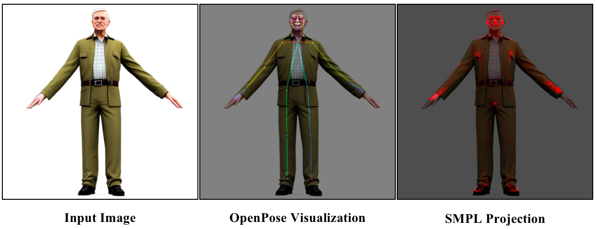

# PrePose: Preprocessing Toolkit for OpenPose-based Multiview Avatar Generation

> **Note**: This project originates from my earlier work and has been recently reorganized and released for reproducibility.

This repository provides a preprocessing pipeline to convert **single-view or multi-view images** into **OpenPose skeleton maps**, with optional concatenation for downstream tasks.  
It is primarily designed as a data preparation module for [Multiview-Avatar](https://github.com/ArcherFMY/Multiview-Avatar), but can be used independently for pose extraction and visualization.

---

## Features
- **Single/Multi-view support**: Convert one or multiple input images to OpenPose keypoints.
- **Skeleton visualization**: Draw OpenPose skeletons overlaid on input images.
- **SMPL projection utilities**: Reproject 3D SMPL meshes into 2D keypoints for comparison.
- **Customizable objectives**: Body, face, and hand keypoint losses included.

---

## Installation

### 1. Clone the repository:
```bash
git clone https://github.com/yourname/prepose.git
cd prepose
```

### 2. Install dependencies:
```bash
pip install -r requirements.txt
```

### 3. Install [OpenPose](https://github.com/CMU-Perceptual-Computing-Lab/openpose) for keypoint extraction.

---

## Usage
### 1. Run OpenPose on input images
extract OpenPose 2D keypoints from raw images
```bash
python predict_2d_pose.py --render_dir /path/to/images --mode b h f --visualize
```
Output:
- `2D_pose.json` with body/hand/face keypoints.
- Visualized skeletons if `--visualize` is set.
### 2. Visualize OpenPose skeletons on the original images
```bash
python draw_op.py --input /path/to/image_or_folder --output /path/to/save.png [--concat]
```
- `--input`: path to **single image** or **folder of images**.
For folder input, the script expects each image to have a corresponding _keypoints.json file (generated by predict_2d_pose.py).
- `--output`: path to save the resulting visualization image.
- `--concat`: if set, concatenates multiple images horizontally in the output.

### 3. SMPL → 2D Keypoints Projection (Optional)
Use `regress.py` to project SMPL 3D vertices to 2D keypoints in OpenPose format.
- Input: SMPL JSON files (from GauHuman / EasyMocap / your SMPL pipeline)
- Output: JSON files containing `pose_keypoints_2d`, `face_keypoints_2d`, `hand_left_keypoints_2d`, `hand_right_keypoints_2d`.

**Example Workflow:**
```bash
python regress.py --mesh_dir path/to/mesh_dir --output_dir path/to/output
# Generates JSON keypoints from SMPL models

python draw_op.py --input path/to/images_or_folder --output result.png --concat
# Visualizes keypoints on images
```

### 4. Generate mesh projections for visualization (Optional)
`format_3d_blender.py` can be used to align 3D meshes and project them onto images for visualization.  
- Input: SMPL mesh (`mesh.obj`) and camera files (`intrinsics.txt`, poses)  
- Output: Projected images saved to `save_dir`  

```bash
python tools/format_3d_blender.py --dir path/to/case_dir --mode project
```
>This is optional and mainly for visualization or preparing image datasets for 2D keypoint regression.

### Result Example

<p align="center">
  
</p>


